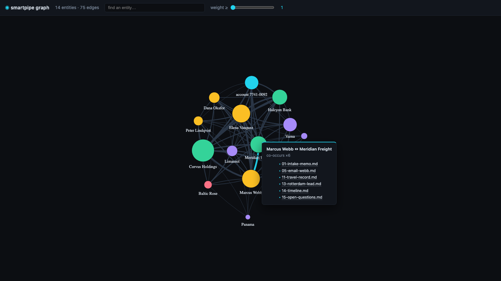
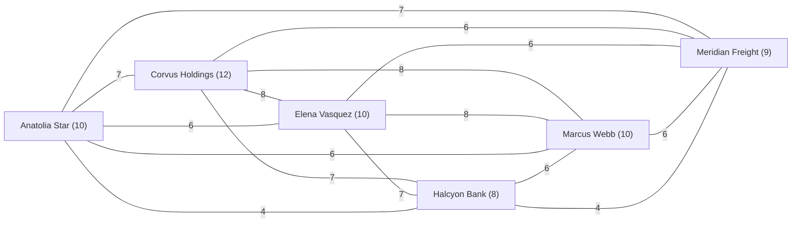

# graph - the corpus as a knowledge graph

Point `graph` at a folder of mixed files and get back who and what connects,
as weighted edges with a source citation on every one. `--fast` does it with
**zero model calls** - a local NER model finds the entities, co-occurrence
draws the edges, and corpus data stays on the machine. First use may download
the local model weights.



*The `--save case.html` view of a 15-file investigation corpus - every edge
hover shows the files that back it.*

## The three cost forms

**Free** - local NER + co-occurrence, `$0` by construction:

```bash
smartpipe graph --fast 'case/*.md' --entities "person, organization, vessel, account" --save case.html
```

**Hybrid** - the same free pass builds the graph, then one model call per edge
names the N strongest relations (`N` calls, no more):

```bash
smartpipe graph "who pays whom" --name-top 200 'case/*.md'
```

**Full** - a focus prompt reads everything: chunk, extract typed triples per
chunk, fold (about one call per ~2k-token chunk, plus one per embedded
figure - the [plan prints first](#the-preflight-plan-and-the-belt)):

```bash
smartpipe graph "who pays whom, who controls what" 'filings/*.pdf' --max-calls 500
```

`stdout` is JSONL edges, heaviest first. This is a real edge from the corpus
in the screenshot, `--fast`, verbatim:

```json
{"source":"Anatolia Star","relation":"co-occurs","target":"account 7741-0092","weight":4,"sources":[{"path":"01-intake-memo.md","as":"file"},{"path":"02-wire-log.md","as":"file"},{"path":"10-charter-draft.md","as":"file"},{"path":"13-rotterdam-lead.md","as":"file"}]}
```

`weight` counts the windows where both entities appear (`--window
sentence|chunk|document` sets how close "together" is); `sources` is the same
provenance spine every verb carries - the receipt for every claim. After the
hybrid upgrade the strongest edges trade `co-occurs` for a model-read relation:

```json
{"source":"Corvus Holdings","relation":"transfers, sent, initiated","target":"Elena Vasquez","weight":8,"sources":[{"path":"01-intake-memo.md","as":"file"},{"path":"02-wire-log.md","as":"file"},{"path":"04-email-vasquez.md","as":"file"},{"path":"05-email-webb.md","as":"file"},{"path":"06-audit-note.md","as":"file"},{"path":"10-charter-draft.md","as":"file"},{"path":"14-timeline.md","as":"file"},{"path":"15-open-questions.md","as":"file"}]}
```

**One long document?** A corpus that is effectively a single window - one long
recording, one big file read whole - makes *everything* co-occur with
*everything*: a near-complete graph is window math, not signal, and the run
says so on `stderr` when it happens. Reach for two dials from [the options
table](#options), in this order: `--window sentence` first, to tighten what
"together" means, then `--min-weight 2` to keep only the pairs that recur.
`--min-weight 2` *alone* empties a one-window corpus - every pair there
co-occurs exactly once, so nothing recurs until the window is smaller.

The entity types are yours to name: the default set is `"person, organization,
location"`, and `--entities "person, vessel, account"` retargets the same local
model at whatever your corpus is about - no retraining, no configuration.
Near-duplicate names (`Elena Vasquez` / `E. Vasquez`) fold onto one node, and
the fold is disclosed on `stderr`. Every run ends with an honest receipt:

```text
note: graph: 21 entities (9 folded) · 75 edges (0 pruned) · 0 tok
```

## What each modality gets

The free mode climbs only free rungs; a focus prompt unlocks the paid ladders.
Whatever can't be read is never silently dropped - it is skipped and censused
on `stderr`.

| Input | `--fast` (free ladder) | focus prompt (full ladders) |
|---|---|---|
| text, `.jsonl`, `.csv` | read directly | chunked at ~2k tokens, one extraction call per chunk |
| PDF with a text layer | text extracted locally; embedded figures dropped (noted) | text chunks, plus one vision call per embedded figure |
| scanned PDF, images | skipped and censused | read by the vision model (or `--ocr-model` at ingestion) |
| audio | transcribed locally with whisper (noted per row) | 10-minute slices ride the audio ladder - native where the model hears |
| video | audio track transcribed locally; no track = skipped | 10-minute slices - native video where the wire watches, else frames + transcript |

The census is one line, with the fix inside:

```text
note: 30 files skipped — no free text (images/scans); the full mode or ocr-model reads them
```

## A live Mermaid graph

`--save graph.mmd` writes a Mermaid diagram. This one is real output -
`graph --fast` over the same 15-file corpus, `--top 6`:



Mermaid chokes on big graphs, so the export keeps the biggest hubs (40 by
default) and says so:

```text
note: mermaid capped to the 6 biggest hubs of 12 nodes — --top adjusts it
```

## `--save`: six formats

The extension names the format; a typo refuses before any work is done.

| `--save` | Format | What you get |
|---|---|---|
| `graph.html` | interactive view | one self-contained page: search, a live weight filter, hover provenance cards (the screenshot above). Data embedded; only the renderer loads from a CDN, disclosed in the file header |
| `graph.graphml` | GraphML | opens in Gephi and yEd, attributes included |
| `graph.dot` / `.gv` | Graphviz | weights become pen widths; render with `neato` |
| `graph.mmd` / `.mermaid` | Mermaid | paste into any Markdown that renders `mermaid` fences |
| `graph.csv` | CSV pair | writes `graph.nodes.csv` + `graph.edges.csv`, importable into Neo4j or Kuzu |
| `vault/` (trailing slash) | Obsidian vault | one note per entity with wikilinks to its neighbors, citations per edge, and an `index.md` ranked by mentions - open the folder in Obsidian and use its graph view |

`--top N` caps the *display* formats (`dot`, `mmd`, `html`) to the N biggest
hubs; the data formats (`graphml`, `csv`, the vault) always carry the complete
graph. `--min-weight N` drops edges below N co-occurrences everywhere.

## The preflight plan and the belt

The full mode never spends blind. The cost plan prints before the first call:

```text
note: ~15 extraction calls across 15 files; belt is 5 — the graph will be partial
```

At a terminal, a belt smaller than the need asks before spending:

```text
proceed with a partial graph? [y/N]
```

If you proceed (or stdin is a pipe, where nothing can ask), the run drains at
the cap into a disclosed partial graph - and never pretends it finished:

```text
note: belt hit — 5 of 15 chunks extracted; the graph is partial (rerun raises the belt; cache makes it cheap)
```

A belted run exits `1`, not `0`, so scripts can tell. Rerunning with a higher
`--max-calls` is cheap: cached extractions are free.

The hybrid mode degrades even more gently - edges the belt could not name
simply keep `co-occurs`, disclosed:

```text
note: named 4 of 5 (belt); 1 strongest remain co-occurs
```

## Weak machines

The free pass is CPU work (a one-time ~190 MB model download, then local
inference). On a slow machine, preview on a seeded sample first - same
pipeline, two hundred rows:

```bash
smartpipe sample 200 < corpus.jsonl | smartpipe graph --fast
```

Long runs project their own duration after the first twenty windows and say
so once on `stderr`; Ctrl-C is safe.

## Adopt your own edges

Edge-shaped records on stdin skip extraction entirely - `graph` folds,
canonicalizes, and serializes them for free. Both `{"source", "target"}`
(graph's own output shape) and `{"subject", "relation", "object"}` rows work,
and `weight` and `sources` are carried through:

```bash
cat edges.jsonl | smartpipe graph --save deals.graphml
```

This is the power path after a custom [`extend`](extend.md) extraction, and it
means graph output can be filtered with `jq` or `where` and re-serialized
without re-reading the corpus.

## Options

| Flag | Meaning |
|---|---|
| `--fast` | the free mode: local NER + co-occurrence, zero model calls |
| `--entities "a, b"` | entity types to find (default `"person, organization, location"`); with a focus prompt they become the subject/object type enum |
| `--relations "pays, owns"` | closed relation vocabulary for the model-read modes (typed ontology) |
| `--name-top N` | hybrid mode: free pass, then one naming call per edge for the N strongest (repair retries and the fold's embedding calls also count against `--max-calls`) |
| `--window sentence\|chunk\|document` | how close "together" is (default `chunk`) |
| `--min-weight N` | drop edges co-occurring fewer than N times |
| `--save PATH` | also write `.graphml`/`.dot`/`.mmd`/`.csv`/`.html`, or a `directory/` for an Obsidian vault |
| `--top N` | cap display formats to the N biggest hubs |
| `--model`, `--concurrency`, `--max-calls` | the usual model dials for the paid modes |
| `--ocr-model MODEL` | full mode: parse scanned PDFs/images at ingestion (each use disclosed) |
| `FILES…`, `--from-files`, `--as` | the usual [file inputs](../inputs/files.md) |

## See also

- [A knowledge graph from a mixed corpus](../cookbook/knowledge-graph.md) -
  the full recipe on the playground corpus
- [`extend`](extend.md) for custom edge extraction ·
  [`split`](split.md) for the chunking units the full mode reuses ·
  [`cluster`](cluster.md) when you want themes, not entities
